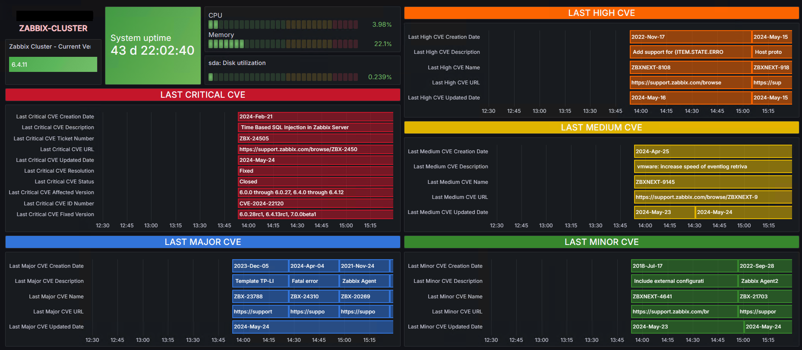

# Zabbix CVE Watch (repost https://github.com/Meun235/Zabbix-CVE-Watch)
The Zabbix CVE Watch template is a collection of 20 items, 5 Triggers and 1 dashboard created for Zabbix 6.2 (other versions should work to but are for now untested.) Together it keeps a close Eye on the Zabbix support site (so you dont have to) and reads out the latest tickets on various CVE's in categories ranging from Critical to Minor.


## Introduction
- Zabbix CVE Watch will retrieve the name of the last vulnerability, the report date, description and the URL. Items are configured with the HTTP agent, which retrieves the data which is then preprocessed with custom java Preprocessing steps.
- Items can be added or changed based on the URL in the Item. The URL consist of a custom search query on to https://support.zabbix.com/projects/ZBX/issues/ in JQL query which contains labels and priority. 
- To reduce the load on the Zabbix site, the page retrieved is the printable version and is limited to 5 items. Data reduction is further achieved by limiting the pulling of the page only ones per 2 to 24 hours (depending on the severity). So far this template seems reasonable popular, so its recommended to keep it at the default setting or if you run non critical infrasturcure make the update frequency even less.
- Every severity as its own trigger attached to the name item that triggers when the last retrieved name changes, it also has its own severity within Zabbix ranging from disaster to informational, based on the severity of the item retrieved.
- The dashboard is listing all items, with in their category, that are pulled every hour and gives a immediate overview of all the last vulnerability per severity.

## Getting Started
#### **1. Step one**
Download the zabbix-cve-watch.yaml 
#### **2. Step two**
In Zabbix go to Data collection -> Templates and in the right top corner click on import.
Find the file you just downloaded and import it.
#### **3. Step three**
Find your zabbix Host under Monitoring -> Host and click on the host in oder to open de host config window.
Now in the colum Templates, find the template you just added named Zabbix CVE Watch and click Update to safe your configuration.

## Inner workings:

### URL's used to retrive CVE information

```
https://support.zabbix.com/sr/jira.issueviews:searchrequest-printable/temp/SearchRequest.html?jqlQuery=issuetype+%3D+%22Defect+%28Security%29%22+AND+priority+%3D+Critical+ORDER+BY+createdDate+DESC&tempMax=5
https://support.zabbix.com/sr/jira.issueviews:searchrequest-printable/temp/SearchRequest.html?jqlQuery=issuetype+%3D+%22Defect+%28Security%29%22+AND+priority+%3D+Blocker+ORDER+BY+createdDate+DESC&tempMax=5
https://support.zabbix.com/sr/jira.issueviews:searchrequest-printable/temp/SearchRequest.html?jqlQuery=issuetype+%3D+%22Defect+%28Security%29%22+AND+priority+%3D+Major+ORDER+BY+createdDate+DESC&tempMax=5
https://support.zabbix.com/sr/jira.issueviews:searchrequest-printable/temp/SearchRequest.html?jqlQuery=issuetype+%3D+%22Defect+%28Security%29%22+AND+priority+%3D+Minor+ORDER+BY+createdDate+DESC&tempMax=5
https://support.zabbix.com/sr/jira.issueviews:searchrequest-printable/temp/SearchRequest.html?jqlQuery=issuetype+%3D+%22Defect+%28Security%29%22+AND+priority+%3D+Trivial+ORDER+BY+createdDate+DESC&tempMax=5
```

**Grafana Dashboard
